```mermaid
flowchart TB
    subgraph current["Texture64.csproj"]
        MAIN["<b>⚙️&nbsp;Texture64.csproj</b><br/><small>net48</small>"]
        click MAIN "#texture64texture64csproj"
    end

```

# Projects and dependencies analysis

This document provides a comprehensive overview of the projects and their dependencies in the context of upgrading to .NETCoreApp,Version=v10.0.

## Table of Contents

- [Executive Summary](#executive-Summary)
  - [Highlevel Metrics](#highlevel-metrics)
  - [Projects Compatibility](#projects-compatibility)
  - [Package Compatibility](#package-compatibility)
  - [API Compatibility](#api-compatibility)
- [Aggregate NuGet packages details](#aggregate-nuget-packages-details)
- [Top API Migration Challenges](#top-api-migration-challenges)
  - [Technologies and Features](#technologies-and-features)
  - [Most Frequent API Issues](#most-frequent-api-issues)
- [Projects Relationship Graph](#projects-relationship-graph)
- [Project Details](#project-details)

  - [Texture64\Texture64.csproj](#texture64texture64csproj)

## Executive Summary

### Highlevel Metrics

| Metric | Count | Status |
| :--- | :---: | :--- |
| Total Projects | 1 | All require upgrade |
| Total NuGet Packages | 4 | All compatible |
| Total Code Files | 13 |  |
| Total Code Files with Incidents | 13 |  |
| Total Lines of Code | 3959 |  |
| Total Number of Issues | 3236 |  |
| Estimated LOC to modify | 3233+ | at least 81.7% of codebase |

### Projects Compatibility

| Project | Target Framework | Difficulty | Package Issues | API Issues | Est. LOC Impact | Description |
| :--- | :---: | :---: | :---: | :---: | :---: | :--- |
| [Texture64\Texture64.csproj](#texture64texture64csproj) | net48 | 🟡 Medium | 1 | 3233 | 3233+ | ClassicWinForms, Sdk Style = False |

### Package Compatibility

| Status | Count | Percentage |
| :--- | :---: | :---: |
| ✅ Compatible | 4 | 100.0% |
| ⚠️ Incompatible | 0 | 0.0% |
| 🔄 Upgrade Recommended | 0 | 0.0% |
| ***Total NuGet Packages*** | ***4*** | ***100%*** |

### API Compatibility

| Category | Count | Impact |
| :--- | :---: | :--- |
| 🔴 Binary Incompatible | 3003 | High - Require code changes |
| 🟡 Source Incompatible | 230 | Medium - Needs re-compilation and potential conflicting API error fixing |
| 🔵 Behavioral change | 0 | Low - Behavioral changes that may require testing at runtime |
| ✅ Compatible | 2673 |  |
| ***Total APIs Analyzed*** | ***5906*** |  |

## Aggregate NuGet packages details

| Package | Current Version | Suggested Version | Projects | Description |
| :--- | :---: | :---: | :--- | :--- |
| Microsoft.Windows.SDK.Contracts | 10.0.26100.7463 |  | [Texture64.csproj](#texture64texture64csproj) | ✅Compatible |
| System.Runtime.InteropServices.WindowsRuntime | 4.3.0 |  | [Texture64.csproj](#texture64texture64csproj) | NuGet package functionality is included with framework reference |
| System.Runtime.WindowsRuntime | 4.6.0 |  | [Texture64.csproj](#texture64texture64csproj) | ✅Compatible |
| System.Runtime.WindowsRuntime.UI.Xaml | 4.6.0 |  | [Texture64.csproj](#texture64texture64csproj) | ✅Compatible |

## Top API Migration Challenges

### Technologies and Features

| Technology | Issues | Percentage | Migration Path |
| :--- | :---: | :---: | :--- |
| Windows Forms | 3003 | 92.9% | Windows Forms APIs for building Windows desktop applications with traditional Forms-based UI that are available in .NET on Windows. Enable Windows Desktop support: Option 1 (Recommended): Target net9.0-windows; Option 2: Add <UseWindowsDesktop>true</UseWindowsDesktop>; Option 3 (Legacy): Use Microsoft.NET.Sdk.WindowsDesktop SDK. |
| GDI+ / System.Drawing | 211 | 6.5% | System.Drawing APIs for 2D graphics, imaging, and printing that are available via NuGet package System.Drawing.Common. Note: Not recommended for server scenarios due to Windows dependencies; consider cross-platform alternatives like SkiaSharp or ImageSharp for new code. |
| Legacy Configuration System | 18 | 0.6% | Legacy XML-based configuration system (app.config/web.config) that has been replaced by a more flexible configuration model in .NET Core. The old system was rigid and XML-based. Migrate to Microsoft.Extensions.Configuration with JSON/environment variables; use System.Configuration.ConfigurationManager NuGet package as interim bridge if needed. |
| Windows Forms Legacy Controls | 11 | 0.3% | Legacy Windows Forms controls that have been removed from .NET Core/5+ including StatusBar, DataGrid, ContextMenu, MainMenu, MenuItem, and ToolBar. These controls were replaced by more modern alternatives. Use ToolStrip, MenuStrip, ContextMenuStrip, and DataGridView instead. |

### Most Frequent API Issues

| API | Count | Percentage | Category |
| :--- | :---: | :---: | :--- |
| T:System.Windows.Forms.Label | 296 | 9.2% | Binary Incompatible |
| T:System.Windows.Forms.NumericUpDown | 125 | 3.9% | Binary Incompatible |
| T:System.Windows.Forms.TableLayoutPanel | 84 | 2.6% | Binary Incompatible |
| T:System.Windows.Forms.Button | 71 | 2.2% | Binary Incompatible |
| P:System.Windows.Forms.Control.Size | 70 | 2.2% | Binary Incompatible |
| T:System.Windows.Forms.MouseEventHandler | 70 | 2.2% | Binary Incompatible |
| T:System.Windows.Forms.ToolStripButton | 68 | 2.1% | Binary Incompatible |
| P:System.Windows.Forms.Control.Name | 68 | 2.1% | Binary Incompatible |
| P:System.Windows.Forms.Control.Location | 67 | 2.1% | Binary Incompatible |
| P:System.Windows.Forms.Control.TabIndex | 61 | 1.9% | Binary Incompatible |
| T:System.Windows.Forms.Keys | 57 | 1.8% | Binary Incompatible |
| T:System.Windows.Forms.AnchorStyles | 56 | 1.7% | Binary Incompatible |
| T:System.Windows.Forms.GroupBox | 49 | 1.5% | Binary Incompatible |
| T:System.Drawing.Bitmap | 47 | 1.5% | Source Incompatible |
| T:System.Windows.Forms.Padding | 46 | 1.4% | Binary Incompatible |
| T:System.Windows.Forms.ToolStripMenuItem | 45 | 1.4% | Binary Incompatible |
| P:System.Windows.Forms.Label.Text | 44 | 1.4% | Binary Incompatible |
| T:System.Windows.Forms.ToolStripComboBox | 43 | 1.3% | Binary Incompatible |
| T:System.Windows.Forms.Control.ControlCollection | 42 | 1.3% | Binary Incompatible |
| P:System.Windows.Forms.Control.Controls | 42 | 1.3% | Binary Incompatible |
| M:System.Windows.Forms.Control.ControlCollection.Add(System.Windows.Forms.Control) | 42 | 1.3% | Binary Incompatible |
| T:System.Windows.Forms.PictureBox | 36 | 1.1% | Binary Incompatible |
| T:System.Windows.Forms.ToolStripStatusLabel | 35 | 1.1% | Binary Incompatible |
| T:System.Drawing.ContentAlignment | 33 | 1.0% | Source Incompatible |
| T:System.Windows.Forms.ContextMenuStrip | 32 | 1.0% | Binary Incompatible |
| T:System.Windows.Forms.DialogResult | 31 | 1.0% | Binary Incompatible |
| P:System.Windows.Forms.NumericUpDown.Value | 30 | 0.9% | Binary Incompatible |
| P:System.Windows.Forms.Control.Enabled | 30 | 0.9% | Binary Incompatible |
| T:System.Windows.Forms.CheckBox | 29 | 0.9% | Binary Incompatible |
| M:System.Windows.Forms.Label.#ctor | 26 | 0.8% | Binary Incompatible |
| T:System.Windows.Forms.TextBox | 26 | 0.8% | Binary Incompatible |
| T:System.Windows.Forms.TableLayoutControlCollection | 25 | 0.8% | Binary Incompatible |
| P:System.Windows.Forms.TableLayoutPanel.Controls | 25 | 0.8% | Binary Incompatible |
| M:System.Windows.Forms.TableLayoutControlCollection.Add(System.Windows.Forms.Control,System.Int32,System.Int32) | 25 | 0.8% | Binary Incompatible |
| T:System.Windows.Forms.ToolStripSeparator | 24 | 0.7% | Binary Incompatible |
| P:System.Windows.Forms.ToolStripItem.Name | 23 | 0.7% | Binary Incompatible |
| P:System.Windows.Forms.Control.Margin | 22 | 0.7% | Binary Incompatible |
| P:System.Windows.Forms.Label.AutoSize | 22 | 0.7% | Binary Incompatible |
| P:System.Drawing.Image.Width | 21 | 0.6% | Source Incompatible |
| T:System.Windows.Forms.ToolStripLabel | 21 | 0.6% | Binary Incompatible |
| P:System.Windows.Forms.ToolStripItem.Size | 20 | 0.6% | Binary Incompatible |
| P:System.Windows.Forms.ToolStripItem.Text | 19 | 0.6% | Binary Incompatible |
| T:System.Drawing.Image | 18 | 0.6% | Source Incompatible |
| T:System.Windows.Forms.DockStyle | 18 | 0.6% | Binary Incompatible |
| T:System.Windows.Forms.RowStyle | 17 | 0.5% | Binary Incompatible |
| T:System.Windows.Forms.TableLayoutRowStyleCollection | 17 | 0.5% | Binary Incompatible |
| P:System.Windows.Forms.TableLayoutPanel.RowStyles | 17 | 0.5% | Binary Incompatible |
| M:System.Windows.Forms.TableLayoutRowStyleCollection.Add(System.Windows.Forms.RowStyle) | 17 | 0.5% | Binary Incompatible |
| T:System.Windows.Forms.FormWindowState | 16 | 0.5% | Binary Incompatible |
| T:System.Windows.Forms.VScrollBar | 16 | 0.5% | Binary Incompatible |

## Projects Relationship Graph

Legend:
📦 SDK-style project
⚙️ Classic project

## Project Details

### Texture64\Texture64.csproj

#### Project Info

- **Current Target Framework:** net48
- **Proposed Target Framework:** net10.0-windows
- **SDK-style**: False
- **Project Kind:** ClassicWinForms
- **Dependencies**: 0
- **Dependants**: 0
- **Number of Files**: 19
- **Number of Files with Incidents**: 13
- **Lines of Code**: 3959
- **Estimated LOC to modify**: 3233+ (at least 81.7% of the project)

#### Dependency Graph

Legend:
📦 SDK-style project
⚙️ Classic project

### API Compatibility

| Category | Count | Impact |
| :--- | :---: | :--- |
| 🔴 Binary Incompatible | 3003 | High - Require code changes |
| 🟡 Source Incompatible | 230 | Medium - Needs re-compilation and potential conflicting API error fixing |
| 🔵 Behavioral change | 0 | Low - Behavioral changes that may require testing at runtime |
| ✅ Compatible | 2673 |  |
| ***Total APIs Analyzed*** | ***5906*** |  |

#### Project Technologies and Features

| Technology | Issues | Percentage | Migration Path |
| :--- | :---: | :---: | :--- |
| Legacy Configuration System | 18 | 0.6% | Legacy XML-based configuration system (app.config/web.config) that has been replaced by a more flexible configuration model in .NET Core. The old system was rigid and XML-based. Migrate to Microsoft.Extensions.Configuration with JSON/environment variables; use System.Configuration.ConfigurationManager NuGet package as interim bridge if needed. |
| Windows Forms Legacy Controls | 11 | 0.3% | Legacy Windows Forms controls that have been removed from .NET Core/5+ including StatusBar, DataGrid, ContextMenu, MainMenu, MenuItem, and ToolBar. These controls were replaced by more modern alternatives. Use ToolStrip, MenuStrip, ContextMenuStrip, and DataGridView instead. |
| GDI+ / System.Drawing | 211 | 6.5% | System.Drawing APIs for 2D graphics, imaging, and printing that are available via NuGet package System.Drawing.Common. Note: Not recommended for server scenarios due to Windows dependencies; consider cross-platform alternatives like SkiaSharp or ImageSharp for new code. |
| Windows Forms | 3003 | 92.9% | Windows Forms APIs for building Windows desktop applications with traditional Forms-based UI that are available in .NET on Windows. Enable Windows Desktop support: Option 1 (Recommended): Target net9.0-windows; Option 2: Add <UseWindowsDesktop>true</UseWindowsDesktop>; Option 3 (Legacy): Use Microsoft.NET.Sdk.WindowsDesktop SDK. |

