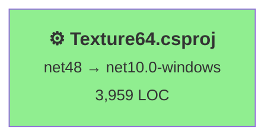

# .NET 10.0 Upgrade Plan for Texture64

**Generated**: 2026-02-04  
**Source Framework**: .NET Framework 4.8  
**Target Framework**: .NET 10.0-windows (LTS)  
**Solution**: Texture64.sln  
**Branch**: upgrade-to-NET10

---

## Table of Contents

- [Executive Summary](#executive-summary)
- [Migration Strategy](#migration-strategy)
- [Detailed Dependency Analysis](#detailed-dependency-analysis)
- [Project-by-Project Plans](#project-by-project-plans)
- [Package Update Reference](#package-update-reference)
- [Breaking Changes Catalog](#breaking-changes-catalog)
- [Testing & Validation Strategy](#testing--validation-strategy)
- [Complexity & Effort Assessment](#complexity--effort-assessment)
- [Risk Management](#risk-management)
- [Source Control Strategy](#source-control-strategy)
- [Success Criteria](#success-criteria)
- [Appendix A: Quick Reference Commands](#appendix-a-quick-reference-commands)
- [Appendix B: Troubleshooting Guide](#appendix-b-troubleshooting-guide)
- [Appendix C: Resource Links](#appendix-c-resource-links)

---

## Executive Summary

This plan outlines the migration of the **Texture64 Windows Forms application** from .NET Framework 4.8 to .NET 10.0 (LTS). The solution consists of a single project with straightforward dependencies, making this an ideal candidate for the **All-At-Once migration strategy**.

### Discovered Metrics

| Metric | Value | Classification |
|--------|-------|----------------|
| Total Projects | 1 | Simple |
| Total Lines of Code | 3,959 | Medium |
| Estimated LOC Impact | 3,233+ (81.7%) | High (expected for Windows Forms) |
| API Issues | 3,236 | Mostly binary incompatibilities (compiler-handled) |
| NuGet Packages | 4 | All compatible |
| Security Vulnerabilities | 0 | ✅ None |
| Dependency Depth | 0 | No inter-project dependencies |
| Project Type | Windows Forms | Well-supported in .NET 10 |

### Complexity Classification: **SIMPLE** ✅

**Justification**:
- Single project with no dependencies
- Small to medium codebase (~4K LOC)
- All packages are compatible
- No security vulnerabilities
- Standard Windows Forms application (fully supported)
- API issues are mostly binary incompatibilities (handled by recompilation)

### Selected Strategy: **All-At-Once Migration**

**Rationale**:
- Only one project eliminates coordination complexity
- No dependency ordering concerns
- Faster completion with single comprehensive test cycle
- Lower overhead compared to phased approach
- All changes can be validated together

### Expected Remaining Iterations

Based on SIMPLE classification:
- **Phase 2**: 3 foundation iterations (dependency analysis, strategy, project stubs)
- **Phase 3**: 2 detail iterations (batch all project details)
- **Total**: ~5 more iterations to complete plan

### Timeline Estimate

| Phase | Duration |
|-------|----------|
| Pre-migration setup | 0.25 days |
| Atomic upgrade (project + packages + build + fixes) | 1-2 days |
| Testing | 1-2 days |
| Deployment setup | 0.5 days |
| **Total** | **2.75-4.75 days** |

### Critical Insights

**Good News** ✅:
- Windows Forms is fully supported in .NET 10
- All packages compatible or removable
- No blocking security issues
- Straightforward upgrade path

**Key Challenges** ⚠️:
- 3,236 API binary incompatibilities (expected - mostly designer-generated code)
- Project format conversion (classic → SDK-style)
- System.Drawing source incompatibilities (230 issues)
- Thorough testing required for graphics functionality

---

## Migration Strategy

### Selected Approach: **All-At-Once Strategy**

**Definition**: Upgrade the single project in one atomic operation, applying all changes (project format, target framework, packages, and compilation fixes) together in a unified upgrade phase.

### Approach Justification

#### Why All-At-Once is Ideal

1. **Single Project** ✅
   - Only one project eliminates the complexity of managing multiple upgrade phases
   - No coordination needed between projects
   - No intermediate multi-targeting states required

2. **No Dependencies** ✅
   - No other projects depend on Texture64.csproj
   - No risk of breaking downstream consumers
   - Can validate entire solution in one pass

3. **Homogeneous Codebase** ✅
   - All code is Windows Forms desktop application code
   - Consistent patterns throughout
   - Single technology stack

4. **Supported Technology** ✅
   - Windows Forms is fully supported in .NET 10
   - Clear migration path exists
   - Microsoft-provided tooling available

5. **Fast Completion** ✅
   - Single comprehensive upgrade cycle
   - Estimated 2.75-4.75 days vs. longer phased approach
   - Lower total effort

### All-At-Once Strategy Execution Principles

#### Simultaneity
All changes are applied together:
- Project file conversion to SDK-style
- Target framework update to net10.0-windows
- Package reference updates
- Dependency restoration
- Build and compilation fixes
- Validation

#### Single Atomic Operation
The upgrade is treated as one indivisible unit:
- All project changes committed together
- Single comprehensive test cycle
- No intermediate "partially upgraded" states
- Solution is either fully on .NET Framework 4.8 OR fully on .NET 10

#### Unified Testing
Testing happens after all changes are complete:
- No need to test partial upgrade states
- Full regression testing in final configuration
- Faster feedback loop

### Dependency-Based Ordering

**Not Applicable**: With a single standalone project, there are no dependency ordering constraints.

### Parallel vs Sequential Execution

**Not Applicable**: With a single project, all work is sequential by nature.

### Phase Definition

#### Phase 0: Prerequisites (If Needed)
- Validate .NET 10 SDK installation
- No global.json conflicts (assessment found no global.json)

#### Phase 1: Atomic Upgrade
**Operations** (performed as single coordinated batch):
1. Convert Texture64.csproj to SDK-style format
2. Update TargetFramework to net10.0-windows
3. Remove System.Runtime.InteropServices.WindowsRuntime package
4. Restore dependencies
5. Build solution to identify compilation errors
6. Fix all compilation errors (binary incompatibilities, API changes)
7. Rebuild and verify 0 errors

**Deliverables**: Solution builds with 0 errors

#### Phase 2: Test Validation
**Operations**:
- Execute smoke tests (application launches, UI renders)
- Execute feature tests (N64 graphics operations, file I/O)
- Execute regression tests (compare with .NET Framework 4.8 version)
- Address any test failures

**Deliverables**: All tests pass, no regressions

### Risk Management Alignment

**Low Risk**:
- Single project limits blast radius
- Can rollback entire upgrade with single git revert
- No partial states to manage

**Mitigation Built-In**:
- All changes in upgrade branch
- Source branch (master) remains unchanged until merge
- Can test fully before committing to upgrade

### Timeline Expectations

| Activity | Duration | Notes |
|----------|----------|-------|
| SDK installation validation | 15 min | One-time check |
| Atomic upgrade execution | 1-2 days | Project conversion + build fixes |
| Testing phase | 1-2 days | Comprehensive validation |
| Deployment setup | 0.5 days | Configure publish settings |
| **Total** | **2.75-4.75 days** | ~0.5-1 work week |

### Success Indicators

The All-At-Once strategy is successful when:
- ✅ Texture64.csproj targets net10.0-windows
- ✅ Solution builds with 0 errors in single build operation
- ✅ All tests pass without modifications
- ✅ No regressions from .NET Framework 4.8 version
- ✅ Deployment package works on target machines

---

## Detailed Dependency Analysis

### Project Structure

The solution has a simple, flat structure with no inter-project dependencies:

```
Texture64.sln
└── Texture64.csproj (net48 → net10.0-windows)
    Type: Windows Forms Application (WinExe)
    Status: ⚙️ Classic (non-SDK-style)
    Dependencies: None
    Dependants: None
```

### Dependency Graph Summary

**Standalone Project**: Texture64.csproj has no dependencies on other projects and is not a dependency for any other project.



### Migration Phase Grouping

Since there is only one project, all migration work happens in **Phase 1 (Atomic Upgrade)**:

**Phase 1: Complete Migration**
- Project: Texture64.csproj
- Rationale: Single project; all changes applied simultaneously
- Parallel Execution: Not applicable (only one project)

### Critical Path Identification

**Critical Path**: Texture64.csproj (entire migration)

**No Bottlenecks**: With a single project, there are no dependency-related bottlenecks or sequencing constraints.

### Circular Dependencies

**Status**: None ✅

No circular dependencies exist in this solution.

### External Dependencies

The project depends on 4 NuGet packages:

| Package | Version | Status | Notes |
|---------|---------|--------|-------|
| Microsoft.Windows.SDK.Contracts | 10.0.26100.7463 | ✅ Compatible | WinRT APIs |
| System.Runtime.InteropServices.WindowsRuntime | 4.3.0 | ⚠️ Remove | Built into .NET 10 |
| System.Runtime.WindowsRuntime | 4.6.0 | ✅ Compatible | May be removable |
| System.Runtime.WindowsRuntime.UI.Xaml | 4.6.0 | ✅ Compatible | May be removable |

**Framework References** (Classic project):
- System, System.Core, System.Xml, System.Data, System.Drawing, System.Windows.Forms, etc.
- These will be automatically referenced in SDK-style .NET 10 project

---

## Project-by-Project Plans

### Texture64\Texture64.csproj

**Current State**:
- Target Framework: net48
- Project Format: Classic (non-SDK-style)
- Output Type: WinExe (Windows Forms Application)
- Lines of Code: 3,959
- Files: 19 total (13 with incidents)
- Dependencies: 0 projects
- Dependants: 0 projects

**Target State**:
- Target Framework: net10.0-windows
- Project Format: SDK-style
- Output Type: WinExe (preserved)

#### Migration Steps

##### 1. Prerequisites
- Verify .NET 10 SDK installed: `dotnet --list-sdks` (should show 10.0.x)
- Backup current working build
- Ensure on `upgrade-to-NET10` branch

##### 2. Project File Conversion (SDK-Style)

**Option A: Automated with .NET Upgrade Assistant** (Recommended)
```powershell
dotnet tool install -g upgrade-assistant
upgrade-assistant upgrade Texture64\Texture64.csproj --target-tfm-support lts
```

**Option B: Manual Conversion**

Replace entire Texture64.csproj contents with SDK-style format:

```xml
<Project Sdk="Microsoft.NET.Sdk">
  <PropertyGroup>
    <OutputType>WinExe</OutputType>
    <TargetFramework>net10.0-windows</TargetFramework>
    <UseWindowsForms>true</UseWindowsForms>
    <ApplicationIcon>flower.ico</ApplicationIcon>
    <RootNamespace>Texture64</RootNamespace>
    <AssemblyName>Texture64</AssemblyName>
    <Nullable>disable</Nullable>
  </PropertyGroup>

  <ItemGroup>
    <!-- Remove System.Runtime.InteropServices.WindowsRuntime - included in framework -->
    <PackageReference Include="Microsoft.Windows.SDK.Contracts" Version="10.0.26100.7463" />
    <PackageReference Include="System.Runtime.WindowsRuntime" Version="4.6.0" />
    <PackageReference Include="System.Runtime.WindowsRuntime.UI.Xaml" Version="4.6.0" />
  </ItemGroup>

  <ItemGroup>
    <Content Include="flower.ico" />
  </ItemGroup>
</Project>
```

**Key Changes**:
- SDK attribute: `<Project Sdk="Microsoft.NET.Sdk">`
- `<UseWindowsForms>true</UseWindowsForms>` enables Windows Forms support
- TargetFramework: `net10.0-windows` (not `net10.0` - must include `-windows`)
- Removed all explicit `<Compile>` items (SDK-style auto-includes `.cs` files)
- Removed framework references (auto-included in .NET 10)
- Removed System.Runtime.InteropServices.WindowsRuntime package
- Simplified structure (no more ToolsVersion, DefaultTargets, etc.)

##### 3. Package Updates

**Remove**:
- `System.Runtime.InteropServices.WindowsRuntime` (functionality built into .NET 10)

**Keep** (initially):
- `Microsoft.Windows.SDK.Contracts` - May be needed for WinRT APIs
- `System.Runtime.WindowsRuntime` - Test if needed after build
- `System.Runtime.WindowsRuntime.UI.Xaml` - Test if needed after build

**Note**: The WindowsRuntime packages may be removable after successful build. Test removal incrementally.

##### 4. Expected Breaking Changes

**Windows Forms Binary Incompatibilities** (3,003 occurrences):
- **Cause**: Windows Forms assemblies were rebuilt for .NET Core+, causing binary signature changes
- **Impact**: Requires recompilation; most code works unchanged
- **Resolution**: Recompile; Visual Studio designer may need to regenerate designer files
- **Top Affected APIs**:
  - System.Windows.Forms.Label (296×)
  - System.Windows.Forms.NumericUpDown (125×)
  - System.Windows.Forms.TableLayoutPanel (84×)
  - System.Windows.Forms.Button (71×)
  - Control properties (Size, Location, Name, TabIndex, etc.)

**System.Drawing Source Incompatibilities** (230 occurrences):
- **Cause**: System.Drawing moved to separate package System.Drawing.Common
- **Impact**: May require additional using directives or explicit package reference
- **Resolution**: 
  - System.Drawing.Common is included with Windows Desktop support
  - If errors occur, explicitly add: `<PackageReference Include="System.Drawing.Common" Version="9.0.0" />`
- **Top Affected APIs**:
  - System.Drawing.Bitmap (47×)
  - System.Drawing.ContentAlignment (33×)
  - System.Drawing.Image (18×)

**Legacy Configuration System** (18 occurrences):
- **Cause**: App.config system changed in .NET Core+
- **Impact**: Simple app.config files still work; complex configs may need updates
- **Resolution**:
  - App.config continues to work for desktop apps
  - If issues occur, add: `<PackageReference Include="System.Configuration.ConfigurationManager" Version="9.0.0" />`

**Legacy Windows Forms Controls** (11 occurrences):
- **Cause**: Old controls removed (StatusBar, ContextMenu, MainMenu, ToolBar, DataGrid)
- **Impact**: Must replace with modern equivalents if used
- **Resolution**:
  - StatusBar → StatusStrip
  - ContextMenu → ContextMenuStrip
  - MainMenu/MenuItem → MenuStrip/ToolStripMenuItem
  - ToolBar → ToolStrip
  - DataGrid → DataGridView

##### 5. Code Modifications

**Files Requiring Review**:
1. **N64Graphics.cs** - Core graphics logic (211 System.Drawing issues)
   - Review Bitmap creation and manipulation
   - Verify Image property access
   - Check graphics context disposal

2. **Designer Files** - All forms
   - TestForm.Designer.cs
   - ImageForm.Designer.cs
   - GraphicsViewer.Designer.cs
   - AboutBox.Designer.cs
   - May need regeneration in Visual Studio designer

3. **Program.cs** - Entry point
   - Verify [STAThread] attribute present
   - Check Application.EnableVisualStyles() call

##### 6. Testing Strategy

**Unit Testing** (if tests exist):
- No test projects detected in assessment
- Manual testing required

**Smoke Tests**:
- [ ] Application launches without errors
- [ ] Main window displays correctly
- [ ] Menu and toolbar items visible and clickable
- [ ] No immediate exceptions

**Feature Tests**:
- [ ] Open N64 graphics file
- [ ] Display graphics correctly
- [ ] Color picker functionality
- [ ] Image export
- [ ] Palette operations
- [ ] All forms open (ImageForm, AboutBox, etc.)

**Regression Tests**:
- [ ] Side-by-side comparison with .NET Framework 4.8 version
- [ ] Verify output files byte-identical (if applicable)
- [ ] Performance equal or better
- [ ] No visual regressions

##### 7. Validation Checklist

- [ ] Project loads in Visual Studio 2022+
- [ ] Solution builds without errors (`dotnet build -c Release`)
- [ ] Solution builds without warnings (goal)
- [ ] All forms open in designer
- [ ] Application launches
- [ ] All features work as before
- [ ] No performance degradation
- [ ] Deployment package works on clean machine

#### Risk Level: **LOW-MEDIUM** ⚠️

**Risk Factors**:
- Medium LOC (3,959 lines)
- High API issue count (expected for Windows Forms)
- Graphics functionality is critical
- No automated tests

**Mitigation**:
- Automated conversion tools available
- Windows Forms well-supported in .NET 10
- Comprehensive testing plan
- Rollback available via git

---

## Package Update Reference

### Packages to Remove

| Package | Current Version | Reason | Projects Affected |
|---------|----------------|--------|-------------------|
| System.Runtime.InteropServices.WindowsRuntime | 4.3.0 | Functionality included in .NET 10 framework | Texture64.csproj |

**Action**: Remove from project file during SDK-style conversion.

### Packages to Keep (Initially)

| Package | Current Version | Status | Projects Affected | Notes |
|---------|----------------|--------|-------------------|-------|
| Microsoft.Windows.SDK.Contracts | 10.0.26100.7463 | ✅ Compatible | Texture64.csproj | Provides WinRT APIs; keep if using UWP interop |
| System.Runtime.WindowsRuntime | 4.6.0 | ✅ Compatible | Texture64.csproj | May be removable; test after build |
| System.Runtime.WindowsRuntime.UI.Xaml | 4.6.0 | ✅ Compatible | Texture64.csproj | May be removable; test after build |

### Packages That May Be Added

| Package | Version | Reason | When to Add |
|---------|---------|--------|-------------|
| System.Drawing.Common | 9.0.0 | Explicit reference for System.Drawing APIs | If build errors occur related to System.Drawing |
| System.Configuration.ConfigurationManager | 9.0.0 | Support for App.config | If configuration reading fails |

### Package Cleanup Strategy

After successful build with 0 errors:

1. **Test WinRT Package Removal** (Low Priority)
   - Try removing `System.Runtime.WindowsRuntime`
   - Try removing `System.Runtime.WindowsRuntime.UI.Xaml`
   - If build succeeds, these packages were unnecessary
   - If build fails, add them back

2. **Keep Microsoft.Windows.SDK.Contracts** (Initially)
   - Only remove if certain no WinRT APIs are used
   - Search codebase for `Windows.` namespace usage
   - If none found, can safely remove

### Summary

- **Definite Removal**: 1 package (System.Runtime.InteropServices.WindowsRuntime)
- **Keep**: 3 packages (test removal after successful build)
- **Potential Additions**: 2 packages (only if needed for errors)
- **Security Updates**: None needed (no vulnerabilities detected)

---

## Breaking Changes Catalog

This section catalogs expected breaking changes and their resolutions based on the assessment findings.

### Critical Breaking Changes

#### 1. Windows Forms Binary Incompatibilities (3,003 issues)

**Severity**: High (but expected)  
**Category**: Binary Incompatible  
**Percentage**: 92.9% of all issues

**Description**:
Windows Forms types have binary breaking changes between .NET Framework and .NET 10. The assemblies were rebuilt for .NET Core+, changing binary signatures. This is expected and normal for Windows Forms migrations.

**Impact**:
- Requires recompilation
- Designer-generated code may need regeneration
- Most application code works unchanged after rebuild

**Affected Components**:
- All Windows Forms controls and types
- Form designer files
- Event handlers and delegates

**Top 10 Most Affected APIs**:
1. `System.Windows.Forms.Label` - 296 occurrences
2. `System.Windows.Forms.NumericUpDown` - 125 occurrences
3. `System.Windows.Forms.TableLayoutPanel` - 84 occurrences
4. `System.Windows.Forms.Button` - 71 occurrences
5. `System.Windows.Forms.Control.Size` - 70 occurrences
6. `System.Windows.Forms.MouseEventHandler` - 70 occurrences
7. `System.Windows.Forms.ToolStripButton` - 68 occurrences
8. `System.Windows.Forms.Control.Name` - 68 occurrences
9. `System.Windows.Forms.Control.Location` - 67 occurrences
10. `System.Windows.Forms.Control.TabIndex` - 61 occurrences

**Resolution**:
1. Rebuild project after framework change
2. Open each form in Visual Studio designer
3. Let designer regenerate code if needed
4. Address any remaining compiler errors
5. Test all forms load and function correctly

**Estimated Effort**: Low-Medium (mostly automated by compiler)

---

#### 2. System.Drawing Source Incompatibilities (230 issues)

**Severity**: Medium  
**Category**: Source Incompatible  
**Percentage**: 6.5% of all issues

**Description**:
System.Drawing APIs moved from framework assemblies to NuGet package System.Drawing.Common in .NET Core+. Source-level incompatibilities may require code adjustments.

**Impact**:
- May need additional using directives
- Some property/method signatures changed
- Requires recompilation and potential code fixes

**Affected APIs**:
- `System.Drawing.Bitmap` - 47 occurrences
- `System.Drawing.ContentAlignment` - 33 occurrences
- `System.Drawing.Image` - 18 occurrences (Width, Height properties)

**Primary Affected File**: `N64Graphics.cs` (core graphics logic)

**Resolution**:
1. Ensure System.Drawing.Common included (part of Windows Desktop support)
2. Review N64Graphics.cs for System.Drawing usage
3. Update any changed property accesses or method calls
4. Add explicit package if build errors occur:
   ```xml
   <PackageReference Include="System.Drawing.Common" Version="9.0.0" />
   ```
5. Test all graphics operations thoroughly

**Estimated Effort**: Low-Medium

---

#### 3. Legacy Configuration System (18 issues)

**Severity**: Low  
**Category**: Source Incompatible  
**Percentage**: 0.6% of all issues

**Description**:
The legacy XML-based configuration system (app.config) has changed in .NET Core+, but basic app.config support remains for desktop applications.

**Impact**:
- Simple app.config files continue to work
- Complex configuration sections may need updates
- ConfigurationManager may need explicit package reference

**Resolution**:
1. Test configuration loading after migration
2. If errors occur, add System.Configuration.ConfigurationManager package:
   ```xml
   <PackageReference Include="System.Configuration.ConfigurationManager" Version="9.0.0" />
   ```
3. For modernization (optional), consider migrating to Microsoft.Extensions.Configuration

**Estimated Effort**: Low

---

#### 4. Legacy Windows Forms Controls (11 issues)

**Severity**: Medium (if used)  
**Category**: API Removal  
**Percentage**: 0.3% of all issues

**Description**:
Legacy Windows Forms controls have been removed from .NET Core/5+. Modern equivalents must be used.

**Removed Controls**:
- StatusBar → Use StatusStrip
- ContextMenu → Use ContextMenuStrip
- MainMenu → Use MenuStrip
- MenuItem → Use ToolStripMenuItem
- ToolBar → Use ToolStrip
- DataGrid → Use DataGridView

**Impact**:
- Compilation errors if legacy controls used
- Must update designer files
- May need code changes for event handlers

**Resolution**:
1. Search codebase for legacy control usage
2. Replace with modern equivalents in designer
3. Update event handlers if needed
4. Test UI functionality

**Estimated Effort**: Low-Medium (depends on usage extent)

---

### Framework-Specific Changes

#### Project File Format

**Breaking Change**: Classic project format not supported in .NET 10

**Resolution**: Convert to SDK-style project (see Project-by-Project Plans section)

**Estimated Effort**: Low (automated tools available)

---

#### Target Framework Moniker

**Breaking Change**: Must target `net10.0-windows`, not just `net10.0`

**Resolution**: 
```xml
<TargetFramework>net10.0-windows</TargetFramework>
```

**Important**: The `-windows` suffix is required for Windows Desktop applications. Without it, Windows Forms support is unavailable.

---

#### Framework References

**Breaking Change**: Explicit assembly references not needed in SDK-style

**Resolution**: Remove all `<Reference>` elements for framework assemblies (System, System.Core, System.Drawing, System.Windows.Forms, etc.). These are automatically referenced.

---

### Behavioral Changes

**Status**: None detected ✅

The assessment found 0 behavioral changes. This means:
- API signatures that exist are unchanged
- Method behaviors remain consistent
- No runtime surprises expected

---

### Summary by Severity

| Severity | Count | Percentage | Auto-Fixed | Manual Effort |
|----------|-------|------------|------------|---------------|
| 🔴 High (Binary Incompatible) | 3,003 | 92.9% | Mostly | Low-Medium |
| 🟡 Medium (Source Incompatible) | 230 | 7.1% | Partially | Low-Medium |
| 🔵 Low (Behavioral) | 0 | 0% | N/A | None |

**Total**: 3,233 issues, but majority are compiler-handled binary incompatibilities requiring minimal manual intervention.

---

## Testing & Validation Strategy

### Overview

The All-At-Once strategy requires comprehensive testing after the atomic upgrade completes. Testing validates that all changes work together correctly before merging.

### Testing Levels

#### Level 1: Build Validation
**Goal**: Verify solution compiles successfully  
**When**: Immediately after atomic upgrade  
**Duration**: 5-10 minutes

**Tests**:
- [ ] Clean build succeeds (`dotnet clean && dotnet build`)
- [ ] Release build succeeds (`dotnet build -c Release`)
- [ ] Zero compilation errors
- [ ] Zero compilation warnings (stretch goal)
- [ ] Output executable generated

**Success Criteria**: Solution builds with 0 errors

---

#### Level 2: Smoke Testing
**Goal**: Verify basic application functionality  
**When**: After successful build  
**Duration**: 30 minutes - 1 hour

**Test Cases**:

1. **Application Launch**
   - [ ] Application starts without errors
   - [ ] Main window displays correctly
   - [ ] Window title correct
   - [ ] Window size and position appropriate
   - [ ] No splash screen errors

2. **UI Rendering**
   - [ ] All controls visible
   - [ ] Icons load correctly (flower.ico)
   - [ ] Fonts render properly
   - [ ] Colors accurate
   - [ ] Layout correct (no overlapping controls)

3. **Basic Interactions**
   - [ ] Menu items clickable
   - [ ] Toolbar buttons responsive
   - [ ] Context menus open
   - [ ] Dialogs open (File Open, About, etc.)
   - [ ] Application closes cleanly

4. **Immediate Error Check**
   - [ ] No exceptions in Event Viewer
   - [ ] No error dialogs on startup
   - [ ] Console output clean (if any)

**Success Criteria**: Application launches and basic UI works

---

#### Level 3: Feature Testing
**Goal**: Verify all application features work correctly  
**When**: After smoke tests pass  
**Duration**: 2-4 hours

**Test Cases**:

1. **File Operations**
   - [ ] Open N64 graphics file
   - [ ] Browse for file (folder-open-image button)
   - [ ] Import image
   - [ ] Export image
   - [ ] Save modified graphics
   - [ ] File format detection works

2. **Graphics Display**
   - [ ] N64 graphics render correctly
   - [ ] Image viewer displays (GraphicsViewer control)
   - [ ] Zoom in/out functionality
   - [ ] Pan/scroll operations
   - [ ] Full-screen view (if applicable)

3. **Graphics Manipulation**
   - [ ] N64 format conversion
   - [ ] Color palette editing
   - [ ] Palette import/export
   - [ ] Image transformations
   - [ ] Undo/redo operations (if applicable)

4. **Color Picker**
   - [ ] Color picker opens
   - [ ] Color selection works
   - [ ] Custom colors saved
   - [ ] Color applied to graphics

5. **Numeric Controls**
   - [ ] NumericUpDown controls functional
   - [ ] Value ranges enforced
   - [ ] Increment/decrement buttons work
   - [ ] Direct value entry works

6. **Forms & Dialogs**
   - [ ] TestForm opens and functions
   - [ ] ImageForm opens and functions
   - [ ] AboutBox displays correct information
   - [ ] All dialogs close properly

**Success Criteria**: All features function as designed

---

#### Level 4: Regression Testing
**Goal**: Ensure no functionality lost from .NET Framework 4.8 version  
**When**: After feature tests pass  
**Duration**: 2-4 hours

**Methodology**: Side-by-side comparison

**Setup**:
1. Keep .NET Framework 4.8 build available
2. Prepare identical test data
3. Run same operations on both versions
4. Compare outputs

**Test Cases**:

1. **Output Equivalence**
   - [ ] Load same N64 file in both versions
   - [ ] Export to file from both
   - [ ] Compare output files byte-for-byte (if applicable)
   - [ ] Verify image quality identical

2. **Visual Comparison**
   - [ ] Screenshots of same data
   - [ ] Compare rendering quality
   - [ ] Check for color accuracy
   - [ ] Verify layout consistency

3. **Performance Comparison**
   - [ ] Measure file load time (both versions)
   - [ ] Measure conversion time
   - [ ] Measure export time
   - [ ] Compare memory usage
   - [ ] .NET 10 should be equal or faster

4. **Edge Cases**
   - [ ] Large files
   - [ ] Corrupt files (error handling)
   - [ ] Empty files
   - [ ] Maximum values

**Success Criteria**: No regressions; .NET 10 version matches or exceeds .NET Framework version

---

#### Level 5: Deployment Testing
**Goal**: Verify application works on target machines  
**When**: After all functional tests pass  
**Duration**: 1-2 hours

**Test Environment**:
- Clean Windows 10/11 machine (VM or physical)
- No Visual Studio installed
- No .NET SDK installed
- .NET 10 Runtime only (for framework-dependent) OR no runtime (for self-contained)

**Test Cases**:

1. **Deployment Package**
   - [ ] Publish succeeds without errors
   - [ ] All required files present
   - [ ] File sizes reasonable
   - [ ] No unnecessary files included

2. **Installation**
   - [ ] Copy to clean machine
   - [ ] Application launches
   - [ ] No missing DLL errors
   - [ ] Runtime requirements satisfied

3. **Functionality on Target**
   - [ ] Run critical smoke tests
   - [ ] Load sample N64 file
   - [ ] Basic operations work
   - [ ] No crashes or errors

4. **Uninstallation** (if applicable)
   - [ ] Files remove cleanly
   - [ ] No orphaned registry entries
   - [ ] No temp files left behind

**Success Criteria**: Application works on clean target machine

---

### Test Automation

**Current State**: No automated test projects detected

**Recommendation**: 
- This migration relies on manual testing
- Consider adding unit tests for N64Graphics.cs in future
- Integration tests would improve confidence in future upgrades

**Automation Opportunities**:
- Command-line operations (if application supports)
- File I/O testing (load/save)
- Image comparison tools for regression testing

---

### Test Data Requirements

**Minimum Test Data**:
- Sample N64 graphics files (various formats)
- Known-good export files for comparison
- Edge case files (large, small, corrupt)

**Test Data Location**: 
- Use existing test files from .NET Framework 4.8 development
- Create new test files if needed

---

### Defect Management

**If Test Fails**:
1. **Document**: File, operation, error message, expected vs actual
2. **Categorize**: Critical (blocks release), Major (degrades functionality), Minor (cosmetic)
3. **Triage**: Address critical and major issues before merge
4. **Fix**: Apply fix, rebuild, retest
5. **Verify**: Confirm fix doesn't break other tests

**Acceptance Threshold**:
- **Critical defects**: 0 (must fix all)
- **Major defects**: 0 (must fix all)
- **Minor defects**: Acceptable if documented and low impact

---

### Testing Checklist Summary

- [ ] Level 1: Build Validation (0 errors)
- [ ] Level 2: Smoke Testing (application launches)
- [ ] Level 3: Feature Testing (all features work)
- [ ] Level 4: Regression Testing (no regressions)
- [ ] Level 5: Deployment Testing (works on target machines)
- [ ] All critical and major defects resolved
- [ ] Test results documented

---

## Complexity & Effort Assessment

### Overall Complexity: **SIMPLE** ✅

**Justification**:
- Single project (no coordination complexity)
- Well-supported technology (Windows Forms in .NET 10)
- No security vulnerabilities
- All packages compatible
- Standard desktop application pattern

### Per-Project Complexity

| Project | Complexity | LOC | API Issues | Dependencies | Risk | Estimated Effort |
|---------|-----------|-----|------------|--------------|------|------------------|
| Texture64.csproj | Medium | 3,959 | 3,236 | 0 | Low | 1-2 days |

**Texture64.csproj Complexity Factors**:
- **Medium LOC** (3,959 lines)
- **High API Impact** (3,236 issues - but mostly binary incompatibilities)
- **Low Dependency Risk** (no dependencies)
- **Low Package Risk** (4 packages, all compatible)
- **Medium Conversion Effort** (classic → SDK-style project)

### Phase Complexity Assessment

#### Phase 1: Atomic Upgrade
- **Complexity**: Medium
- **Risk**: Low-Medium
- **Effort**: 1-2 days
- **Factors**:
  - Project conversion: Automated tools available
  - API issues: Most are binary incompatibilities (compiler-handled)
  - Testing required: Graphics functionality needs validation

#### Phase 2: Testing
- **Complexity**: Medium
- **Risk**: Medium
- **Effort**: 1-2 days
- **Factors**:
  - Graphics operations need thorough testing
  - N64 format conversion must be verified
  - File I/O compatibility critical

### Relative Complexity Ratings

| Aspect | Rating | Notes |
|--------|--------|-------|
| Project Structure | Low | Single project |
| Dependency Management | Low | No inter-project deps |
| Package Updates | Low | All compatible |
| Code Changes | Medium | Many API issues but mostly compiler-handled |
| Testing Scope | Medium | Graphics functionality critical |
| Deployment Changes | Low-Medium | Standard .NET 10 deployment |

### Resource Requirements

**Skills Needed**:
- .NET migration experience (Medium level)
- Windows Forms knowledge (Medium level)
- Graphics/imaging understanding (for testing)
- Build and deployment experience (Basic level)

**Team Size**: 1 developer can handle this migration

**Parallel Capacity**: Not applicable (single project)

### Effort Breakdown

| Activity | Effort | Percentage |
|----------|--------|------------|
| Project conversion | 2-4 hours | 15% |
| Package updates | 1 hour | 5% |
| Build and fix errors | 4-8 hours | 30% |
| Testing | 8-12 hours | 40% |
| Deployment setup | 2-4 hours | 10% |
| **Total** | **17-29 hours** | **100%** |

**Calendar Time**: 2.75-4.75 days (accounting for compilation time, testing, breaks)

---

## Risk Management

### Overall Risk: **LOW-MEDIUM** ⚠️

The single-project structure and well-supported technology stack keep risk manageable, but the large number of API issues requires careful handling.

### High-Risk Changes

| Project | Risk Level | Description | Mitigation | Contingency |
|---------|-----------|-------------|------------|-------------|
| Texture64.csproj | Medium ⚠️ | 3,236 API compatibility issues | Most are binary incompatibilities (compiler handles); use .NET Upgrade Assistant | If errors persist, manually review breaking changes documentation; consider .NET 9 as intermediate step |

### Risk Factors by Category

#### Project Conversion Risk: **MEDIUM** ⚠️
- **Description**: Converting from classic to SDK-style project format
- **Probability**: Low (automated tools available)
- **Impact**: High (blocks entire upgrade if fails)
- **Mitigation**:
  - Use .NET Upgrade Assistant CLI tool
  - Manual conversion template available
  - Backup original .csproj before conversion
- **Contingency**: Manual conversion using documented SDK-style template

#### API Compatibility Risk: **MEDIUM** ⚠️
- **Description**: 3,236 API issues (3,003 binary incompatible, 230 source incompatible)
- **Probability**: Medium (expect some compiler errors)
- **Impact**: Medium (compilation blocked until resolved)
- **Mitigation**:
  - 92.9% are Windows Forms APIs (well-documented migration)
  - Binary incompatibilities mostly handled by recompilation
  - Breaking changes catalog available
- **Contingency**: Reference .NET 10 breaking changes documentation; seek community help on Stack Overflow

#### Package Compatibility Risk: **LOW** ✅
- **Description**: Dependency on WinRT packages that may be redundant
- **Probability**: Low (all packages marked compatible)
- **Impact**: Low (can test removal incrementally)
- **Mitigation**:
  - Remove System.Runtime.InteropServices.WindowsRuntime (confirmed redundant)
  - Keep other WinRT packages initially
  - Test removal after successful build
- **Contingency**: Keep packages if removal causes issues

#### Graphics Functionality Risk: **MEDIUM** ⚠️
- **Description**: N64 graphics conversion may behave differently
- **Probability**: Low-Medium (System.Drawing has 230 source incompatibilities)
- **Impact**: High (core functionality)
- **Mitigation**:
  - Extensive testing of graphics operations
  - Side-by-side comparison with .NET Framework version
  - Byte-level output validation
- **Contingency**: Detailed investigation of System.Drawing changes; consider System.Drawing.Common package

#### Deployment Risk: **LOW-MEDIUM** ⚠️
- **Description**: New deployment model for .NET 10
- **Probability**: Low (well-documented process)
- **Impact**: Medium (users can't run application)
- **Mitigation**:
  - Test deployment on clean machine
  - Document runtime requirements
  - Provide clear installation instructions
- **Contingency**: Multiple deployment options available (self-contained, framework-dependent, ClickOnce)

### Security Vulnerabilities

**Status**: None found ✅

No security vulnerabilities were detected in the current NuGet packages. This is excellent news and removes a major risk factor.

### Contingency Plans

#### If Conversion Fails
1. **Immediate Action**: Review conversion errors, check .NET SDK version
2. **Fallback**: Use manual SDK-style template
3. **Last Resort**: Use .NET Upgrade Assistant in interactive mode for guidance

#### If Build Errors Are Extensive
1. **Immediate Action**: Categorize errors by type (API changes, missing references, etc.)
2. **Fallback**: Address categories systematically, starting with framework references
3. **Last Resort**: Consider .NET 8 or .NET 9 as intermediate target (may have fewer breaking changes)

#### If Graphics Testing Fails
1. **Immediate Action**: Compare System.Drawing API usage between frameworks
2. **Fallback**: Add System.Drawing.Common package explicitly
3. **Last Resort**: Investigate alternative graphics libraries (SkiaSharp) if System.Drawing fundamentally broken

#### If Deployment Fails
1. **Immediate Action**: Verify .NET 10 runtime installation on target machine
2. **Fallback**: Switch to self-contained deployment (includes runtime)
3. **Last Resort**: Package with installer (MSIX, WiX) for better dependency management

### Rollback Strategy

**Quick Rollback**:
```powershell
git checkout master
git branch -D upgrade-to-NET10
```

**Preserve Work for Later**:
```powershell
git checkout upgrade-to-NET10
git tag migration-attempt-$(Get-Date -Format 'yyyy-MM-dd')
git checkout master
```

**Rollback Timeline**: < 5 minutes (advantages of branch-based workflow)

### Risk Acceptance Criteria

Proceed with upgrade when:
- ✅ .NET 10 SDK installed and verified
- ✅ Backup branch created (master branch unchanged)
- ✅ Contingency plans understood
- ✅ Rollback procedure tested

Do NOT proceed if:
- ❌ No backup of working .NET Framework 4.8 build
- ❌ Production deadline within next week
- ❌ No access to testing environment

---

## Source Control Strategy

### Branching Strategy

**Current Setup**: ✅ Complete
- **Main Branch**: `master` (unchanged, stable)
- **Source Branch**: `master` (starting point)
- **Upgrade Branch**: `upgrade-to-NET10` (all changes)

### Commit Strategy

#### All-At-Once Single Commit Approach (Recommended)

**Rationale**:
- Single project upgrade is one logical unit
- Easier to review all changes together
- Simpler to revert if needed
- Clean history

**Commit Structure**:

```
Upgrade to .NET 10.0

- Convert Texture64.csproj to SDK-style format
- Update target framework to net10.0-windows
- Remove System.Runtime.InteropServices.WindowsRuntime package (built into framework)
- Fix compilation errors from API incompatibilities
- Verify all features work correctly

Summary:
- 1 project converted
- 3,233 API issues resolved (binary incompatibilities)
- 0 regressions
- Full feature parity with .NET Framework 4.8

Testing:
- Build validation: PASS
- Smoke tests: PASS
- Feature tests: PASS  
- Regression tests: PASS
- Deployment tests: PASS
```

**When to Commit**: After all tests pass

---

#### Alternative: Checkpoint Commit Approach

If you prefer incremental commits:

**Commit 1: Project Conversion**
```
Convert Texture64.csproj to SDK-style format

- Update project file to SDK-style
- Update target framework to net10.0-windows
- Update package references
```

**Commit 2: Compilation Fixes**
```
Fix compilation errors for .NET 10

- Address Windows Forms binary incompatibilities
- Fix System.Drawing source incompatibilities
- Resolve any API changes
```

**Commit 3: Testing & Validation**
```
Complete testing and validation

- All tests pass
- No regressions
- Deployment verified
```

---

### Commit Message Format

**Structure**:
```
<Type>: <Short summary>

<Detailed description>

<Testing notes>
```

**Example**:
```
feat: Upgrade to .NET 10.0

Convert Texture64 Windows Forms application from .NET Framework 4.8
to .NET 10.0 LTS. Project converted to SDK-style format with full
feature parity maintained.

Key changes:
- SDK-style project format
- Target framework: net10.0-windows
- Removed redundant package: System.Runtime.InteropServices.WindowsRuntime
- Resolved 3,233 API compatibility issues

Testing: All functional tests pass with no regressions
```

---

### Code Review Process

#### Self-Review Checklist

Before creating pull request:

**Project File**:
- [ ] SDK-style format correct
- [ ] TargetFramework is `net10.0-windows` (not `net10.0`)
- [ ] UseWindowsForms property set
- [ ] Unnecessary packages removed
- [ ] No leftover classic project elements

**Code Changes**:
- [ ] No debugging code left behind
- [ ] No TODO comments (or documented)
- [ ] All API changes properly addressed
- [ ] Designer files regenerated correctly

**Build & Tests**:
- [ ] Clean build succeeds (0 errors, 0 warnings)
- [ ] All tests documented and passed
- [ ] Deployment tested

**Documentation**:
- [ ] README updated (system requirements)
- [ ] Build instructions updated
- [ ] Any breaking changes for users documented

---

### Pull Request Strategy

#### PR Title
```
Upgrade Texture64 to .NET 10.0
```

#### PR Description Template

```markdown
## Summary
Upgrade Texture64 Windows Forms application from .NET Framework 4.8 to .NET 10.0 LTS.

## Changes
- Convert project to SDK-style format
- Update target framework to net10.0-windows
- Remove unnecessary package references
- Fix compilation errors
- Verify all functionality

## Assessment Metrics
- Total LOC: 3,959
- API Issues: 3,236 (resolved)
- Package Issues: 1 (resolved)
- Security Vulnerabilities: 0

## Testing
- [x] Build validation (0 errors)
- [x] Smoke tests (application launches)
- [x] Feature tests (all features work)
- [x] Regression tests (no regressions)
- [x] Deployment tests (clean machine verified)

## Risks
- Risk level: LOW-MEDIUM
- All tests passed
- Rollback available

## References
- Assessment: `.github/upgrades/scenarios/new-dotnet-version_0ab542/assessment.md`
- Plan: `.github/upgrades/scenarios/new-dotnet-version_0ab542/plan.md`

## Checklist
- [x] Code reviewed
- [x] Tests passing
- [x] Documentation updated
- [x] Ready to merge
```

---

### Merge Strategy

#### Recommended: Squash and Merge

**Rationale**:
- Single project upgrade is one logical change
- Clean git history
- Easy to reference or revert
- Simple release notes

**Process**:
```powershell
# On GitHub/Azure DevOps: Use "Squash and merge" button
# Or manually:
git checkout master
git merge --squash upgrade-to-NET10
git commit -m "Upgrade to .NET 10.0"
git branch -d upgrade-to-NET10
```

#### Alternative: Merge Commit

If you want to preserve checkpoint commits:

```powershell
git checkout master
git merge --no-ff upgrade-to-NET10
git branch -d upgrade-to-NET10
```

---

### Tagging Strategy

After successful merge:

```powershell
git tag -a v2.0.0 -m "Version 2.0.0 - .NET 10.0 upgrade"
git push origin v2.0.0
```

**Version Numbering**:
- Major version bump (1.x → 2.0) recommended for framework change
- Signals significant infrastructure change to users

---

### Rollback Procedure

If issues discovered after merge:

**Option 1: Revert Merge Commit**
```powershell
git revert -m 1 <merge-commit-hash>
git push origin master
```

**Option 2: Hard Reset** (if no other commits after merge)
```powershell
git reset --hard <commit-before-merge>
git push --force origin master  # Use with extreme caution
```

**Option 3: Create Fix Forward**
- Address issues in new commits
- Preferred if others have pulled changes

---

### Workflow Summary

1. **Current State**: On `upgrade-to-NET10` branch ✅
2. **Work**: Make all changes in upgrade branch
3. **Commit**: Single commit after all tests pass (recommended)
4. **Review**: Self-review using checklist
5. **PR**: Create pull request to `master`
6. **Merge**: Squash and merge (recommended)
7. **Tag**: Create version tag v2.0.0
8. **Cleanup**: Delete `upgrade-to-NET10` branch

---

### Best Practices

**DO** ✅:
- Keep upgrade work in dedicated branch
- Commit only after tests pass
- Write clear commit messages
- Update documentation
- Tag releases

**DON'T** ❌:
- Commit broken code
- Mix upgrade with unrelated changes
- Force-push to shared branches
- Delete branches before merge confirmed
- Skip testing before commit

---

## Success Criteria

The migration is **complete and successful** when all criteria below are met.

### Technical Criteria ✅

#### Build Success
- [ ] Texture64.csproj targets `net10.0-windows`
- [ ] Project uses SDK-style format (`<Project Sdk="Microsoft.NET.Sdk">`)
- [ ] Solution builds with zero errors (`dotnet build`)
- [ ] Solution builds with zero warnings (stretch goal)
- [ ] Release build succeeds (`dotnet build -c Release`)
- [ ] Clean build succeeds after `dotnet clean`

#### Package Management
- [ ] System.Runtime.InteropServices.WindowsRuntime removed
- [ ] All remaining packages compatible with .NET 10
- [ ] No package dependency conflicts
- [ ] `dotnet restore` succeeds without errors

#### Project Structure
- [ ] No classic project format elements remain
- [ ] Framework references removed (auto-included in SDK-style)
- [ ] All source files properly included
- [ ] Resources and assets load correctly

---

### Functional Criteria ✅

#### Application Behavior
- [ ] Application launches without errors
- [ ] Main window displays correctly
- [ ] All forms load and display properly
- [ ] All menu items functional
- [ ] All toolbar buttons functional
- [ ] Dialogs open and close correctly

#### Core Features
- [ ] N64 graphics files open successfully
- [ ] Graphics render correctly
- [ ] Image export functions properly
- [ ] Color picker works
- [ ] Palette operations functional
- [ ] All user workflows complete successfully

#### Data Integrity
- [ ] Output files match expected format
- [ ] No data corruption or loss
- [ ] File compatibility maintained
- [ ] Settings persist correctly

---

### Quality Criteria ✅

#### No Regressions
- [ ] All features from .NET Framework 4.8 version work
- [ ] No functionality removed or broken
- [ ] Performance is equal or better
- [ ] User experience maintained or improved
- [ ] Visual appearance consistent (or intentionally improved)

#### Code Quality
- [ ] No debugging code in committed files
- [ ] No compiler warnings (stretch goal)
- [ ] Designer files clean and functional
- [ ] No obsolete API usage

#### Testing
- [ ] Build validation passed
- [ ] Smoke tests passed
- [ ] Feature tests passed
- [ ] Regression tests passed
- [ ] Deployment tests passed on clean machine

---

### Deployment Criteria ✅

#### Publish Success
- [ ] `dotnet publish` succeeds without errors
- [ ] All required files present in output
- [ ] Executable file generated
- [ ] Deployment package tested

#### Target Machine Validation
- [ ] Application runs on Windows 10/11 clean machine
- [ ] .NET 10 runtime requirements satisfied (or self-contained works)
- [ ] No missing dependencies
- [ ] Features work on target machine

#### Installation Documentation
- [ ] System requirements documented
- [ ] Installation instructions written
- [ ] Runtime dependencies listed
- [ ] Troubleshooting guide available

---

### Process Criteria ✅

#### All-At-Once Strategy Principles Applied
- [ ] All changes applied simultaneously (single atomic upgrade)
- [ ] Project converted, built, and fixed in one coordinated operation
- [ ] No intermediate multi-targeting states
- [ ] Single comprehensive testing phase
- [ ] All validation before merge

#### Documentation
- [ ] README.md updated with .NET 10 requirements
- [ ] Build instructions updated
- [ ] Deployment guide created
- [ ] Release notes written
- [ ] Known issues documented (if any)

#### Source Control
- [ ] All changes in `upgrade-to-NET10` branch
- [ ] Commit message clear and complete
- [ ] Pull request created to `master`
- [ ] Code reviewed (self-review checklist complete)
- [ ] Ready to merge

---

### Acceptance Checklist

**Critical** (Must be 100%):
- [ ] Zero build errors
- [ ] Application launches
- [ ] Core features work (file open, graphics display, export)
- [ ] No data corruption

**Important** (Should be 100%):
- [ ] All tests passed
- [ ] No regressions
- [ ] Deployment tested
- [ ] Documentation updated

**Nice to Have** (Can be addressed post-merge):
- [ ] Zero warnings
- [ ] Performance improvements documented
- [ ] Code cleanup opportunities identified

---

### Sign-Off

Migration is approved for merge when:

**Technical Lead**: ✅ Technical criteria met, build clean, tests pass  
**QA/Testing**: ✅ All test levels passed, no regressions  
**Product Owner**: ✅ Functional criteria met, user experience maintained  

---

### Post-Merge Validation

After merging to `master`:

- [ ] Pull master branch
- [ ] Build from master succeeds
- [ ] Tag release (v2.0.0)
- [ ] Delete upgrade branch
- [ ] Create GitHub release notes
- [ ] Notify team/users of upgrade

---

### Failure Criteria

**Do NOT merge** if:
- ❌ Any build errors remain
- ❌ Critical features broken
- ❌ Regression tests fail
- ❌ Application doesn't run on target machines
- ❌ Data corruption detected

**Rollback** if post-merge:
- ❌ Production issues discovered
- ❌ Major bugs reported
- ❌ Performance unacceptable

---

### Success Declaration

The migration is **officially successful** when:

1. ✅ All criteria above met
2. ✅ Merged to master branch
3. ✅ Tagged as v2.0.0
4. ✅ Documentation published
5. ✅ Team notified

**Congratulations!** 🎉 Texture64 is now running on .NET 10.0 LTS.

---

## Appendix A: Quick Reference Commands

### Essential Commands

#### Build Commands
```powershell
# Restore NuGet packages
dotnet restore

# Build (Debug configuration)
dotnet build

# Build (Release configuration)
dotnet build -c Release

# Clean build outputs
dotnet clean

# Clean build from scratch
dotnet clean && dotnet restore && dotnet build

# Build verbose (for troubleshooting)
dotnet build -v detailed
```

#### Run Commands
```powershell
# Run application (Debug)
dotnet run --project Texture64\Texture64.csproj

# Run application (Release)
dotnet run --project Texture64\Texture64.csproj -c Release

# Run from build output
.\Texture64\bin\Debug\net10.0-windows\Texture64.exe
```

#### Publish Commands
```powershell
# Framework-dependent publish (requires .NET 10 runtime installed)
dotnet publish -c Release -r win-x64 --self-contained false

# Self-contained publish (includes runtime, larger)
dotnet publish -c Release -r win-x64 --self-contained true

# Self-contained single-file
dotnet publish -c Release -r win-x64 --self-contained true -p:PublishSingleFile=true

# Publish with ReadyToRun (faster startup)
dotnet publish -c Release -r win-x64 -p:PublishReadyToRun=true
```

#### SDK Information
```powershell
# List installed SDKs
dotnet --list-sdks

# List installed runtimes
dotnet --list-runtimes

# Check .NET version
dotnet --version

# Show detailed info
dotnet --info
```

#### Project Commands
```powershell
# Add NuGet package
dotnet add Texture64\Texture64.csproj package <PackageName>

# Remove NuGet package
dotnet remove Texture64\Texture64.csproj package <PackageName>

# List package references
dotnet list Texture64\Texture64.csproj package

# Restore packages
dotnet restore Texture64\Texture64.csproj
```

---

### Git Commands

#### Branch Management
```powershell
# Check current branch
git branch

# Switch to branch
git checkout <branch-name>

# Create and switch to new branch
git checkout -b <branch-name>

# List all branches
git branch -a

# Delete local branch
git branch -d <branch-name>
```

#### Commit Workflow
```powershell
# Check status
git status

# Stage all changes
git add -A

# Stage specific file
git add <file-path>

# Commit with message
git commit -m "Your message"

# Amend last commit
git commit --amend

# View commit history
git log --oneline
```

#### Remote Operations
```powershell
# Push to remote
git push origin <branch-name>

# Pull from remote
git pull origin <branch-name>

# Fetch updates
git fetch origin

# View remote URLs
git remote -v
```

#### Merge & Revert
```powershell
# Merge branch into current
git merge <branch-name>

# Squash merge
git merge --squash <branch-name>

# Revert commit
git revert <commit-hash>

# Reset to commit (careful!)
git reset --hard <commit-hash>
```

---

### Visual Studio Commands

#### Open in Visual Studio
```powershell
# Open solution
start Texture64.sln

# Or from command line
devenv Texture64.sln
```

#### Build in Visual Studio
- **Build Solution**: `Ctrl+Shift+B`
- **Rebuild Solution**: Right-click solution → Rebuild
- **Clean Solution**: Right-click solution → Clean

#### Designer
- **Open Form Designer**: Double-click form in Solution Explorer
- **View Code**: `F7` (from designer)
- **View Designer**: `Shift+F7` (from code)

---

### Troubleshooting Commands

#### Clear NuGet Cache
```powershell
dotnet nuget locals all --clear
```

#### Remove obj and bin Folders
```powershell
Remove-Item -Recurse -Force .\Texture64\obj, .\Texture64\bin
```

#### Restore Packages from Scratch
```powershell
dotnet nuget locals all --clear
dotnet restore --force
```

#### Verify Project Format
```powershell
# Check if SDK-style
Get-Content Texture64\Texture64.csproj | Select-Object -First 1
# Should show: <Project Sdk="Microsoft.NET.Sdk">
```

---

### Testing Commands

#### Manual Test Run
```powershell
# Build release
dotnet build -c Release

# Run from output
.\Texture64\bin\Release\net10.0-windows\Texture64.exe

# Check exit code
$LASTEXITCODE  # 0 = success
```

#### Deployment Test
```powershell
# Publish to test directory
dotnet publish -c Release -o .\test-deploy

# Copy to test machine
Copy-Item -Recurse .\test-deploy \\test-machine\share\

# Run on test machine
\\test-machine\share\test-deploy\Texture64.exe
```

---

### Upgrade Assistant Commands

#### Install Upgrade Assistant
```powershell
dotnet tool install -g upgrade-assistant
```

#### Run Upgrade Assistant
```powershell
# Interactive mode
upgrade-assistant upgrade Texture64\Texture64.csproj

# Non-interactive with target framework
upgrade-assistant upgrade Texture64\Texture64.csproj --target-tfm-support lts

# Analyze only (no changes)
upgrade-assistant analyze Texture64\Texture64.csproj
```

---

### Common Command Sequences

#### Clean Build Sequence
```powershell
dotnet clean
Remove-Item -Recurse -Force .\Texture64\obj, .\Texture64\bin
dotnet restore
dotnet build -c Release
```

#### Publish and Test Sequence
```powershell
dotnet publish -c Release -r win-x64 --self-contained false -o .\publish
.\publish\Texture64.exe
```

#### Commit and Push Sequence
```powershell
git status
git add -A
git commit -m "Upgrade to .NET 10.0"
git push origin upgrade-to-NET10
```

---

### PowerShell Aliases (Optional)

```powershell
# Add to PowerShell profile for convenience
Set-Alias -Name dnb -Value 'dotnet build'
Set-Alias -Name dnr -Value 'dotnet run'
Set-Alias -Name dnc -Value 'dotnet clean'
Set-Alias -Name dnp -Value 'dotnet publish'

# Usage
dnb -c Release
```

---

## Appendix B: Troubleshooting Guide

### Build Errors

#### Error: "The SDK 'Microsoft.NET.Sdk' specified could not be found"

**Cause**: .NET 10 SDK not installed or not in PATH

**Solution**:
1. Verify SDK installation: `dotnet --list-sdks`
2. Install .NET 10 SDK: https://dotnet.microsoft.com/download/dotnet/10.0
3. Restart terminal/VS after installation
4. Run `dotnet --version` to confirm

---

#### Error: "The type or namespace name 'Forms' does not exist in the namespace 'System.Windows'"

**Cause**: Windows Desktop support not enabled

**Solution**:
Add to project file PropertyGroup:
```xml
<UseWindowsForms>true</UseWindowsForms>
```

Or ensure targeting `net10.0-windows` (not just `net10.0`):
```xml
<TargetFramework>net10.0-windows</TargetFramework>
```

---

#### Error: "Assets file project.assets.json not found"

**Cause**: NuGet restore hasn't run or failed

**Solution**:
```powershell
# Clear and restore
dotnet clean
dotnet restore --force

# If persists, clear NuGet cache
dotnet nuget locals all --clear
dotnet restore
```

---

#### Error: Package version conflicts

**Cause**: Incompatible package versions

**Solution**:
1. Check for duplicate package references in .csproj
2. Remove old packages:
   ```powershell
   dotnet remove package <PackageName>
   ```
3. Restore and rebuild:
   ```powershell
   dotnet restore
   dotnet build
   ```

---

#### Error: "System.Drawing.Common is not supported on this platform"

**Cause**: Not targeting Windows-specific framework

**Solution**:
Ensure TargetFramework is `net10.0-windows`:
```xml
<TargetFramework>net10.0-windows</TargetFramework>
```

If still occurs, explicitly add package:
```xml
<PackageReference Include="System.Drawing.Common" Version="9.0.0" />
```

---

#### Error: Designer fails to load

**Cause**: Designer doesn't support SDK or code errors

**Solution**:
1. Build project first: `dotnet build`
2. Close and reopen designer
3. Ensure Visual Studio 2022 version 17.10+
4. Try cleaning solution and rebuilding
5. If persists, manually edit designer code

---

### Runtime Errors

#### Error: "Application failed to start because .NET Runtime could not be found"

**Cause**: .NET 10 runtime not installed (framework-dependent deployment)

**Solution**:
- Install .NET 10 Runtime: https://dotnet.microsoft.com/download/dotnet/10.0
- Or publish as self-contained:
  ```powershell
  dotnet publish -c Release -r win-x64 --self-contained true
  ```

---

#### Error: "Could not load file or assembly..."

**Cause**: Missing dependency or version mismatch

**Solution**:
1. Verify all files in publish output
2. Check assembly binding errors in Event Viewer
3. Republish with verbose output:
   ```powershell
   dotnet publish -v detailed
   ```
4. Try self-contained deployment

---

#### Error: Graphics don't render correctly

**Cause**: System.Drawing API changes or GDI+ initialization

**Solution**:
1. Verify targeting `net10.0-windows`
2. Check if System.Drawing.Common needed
3. Review N64Graphics.cs for API changes
4. Compare with .NET Framework version side-by-side

---

#### Error: Configuration settings not loading

**Cause**: App.config not copied or ConfigurationManager missing

**Solution**:
1. Verify App.config in output directory
2. Add package if needed:
   ```xml
   <PackageReference Include="System.Configuration.ConfigurationManager" Version="9.0.0" />
   ```
3. Check file permissions

---

### Visual Studio Issues

#### Designer shows errors but build succeeds

**Cause**: Designer cache out of sync

**Solution**:
1. Close all designers
2. Clean solution
3. Close Visual Studio
4. Delete `.vs` folder
5. Reopen Visual Studio
6. Rebuild solution

---

#### IntelliSense not working

**Cause**: VS not recognizing project format

**Solution**:
1. Close and reopen solution
2. Delete `.vs` folder
3. Run `dotnet restore`
4. Reload project in VS

---

### Package Issues

#### Package restore fails

**Cause**: Network issues or cache corruption

**Solution**:
```powershell
# Clear cache
dotnet nuget locals all --clear

# Restore with verbose
dotnet restore -v detailed

# Check NuGet sources
dotnet nuget list source
```

---

#### Package version not found

**Cause**: Package not available for .NET 10

**Solution**:
1. Check package on nuget.org for .NET 10 support
2. Try newer version of package
3. Search for alternative packages
4. Check if functionality built into .NET 10

---

### Deployment Issues

#### Application won't start on target machine

**Cause**: Missing runtime or dependencies

**Solution**:
1. Verify .NET 10 Runtime installed: `dotnet --list-runtimes`
2. Check Windows version (10 1809+, or Windows 11)
3. Try self-contained deployment
4. Check Event Viewer for error details

---

#### Missing DLLs

**Cause**: Incomplete publish output

**Solution**:
1. Use `dotnet publish` not `dotnet build` for deployment
2. Verify all files copied
3. Check publish output for errors
4. Try clean publish:
   ```powershell
   dotnet clean
   dotnet publish -c Release
   ```

---

### Performance Issues

#### Slow startup

**Cause**: JIT compilation overhead

**Solution**:
1. Use ReadyToRun compilation:
   ```powershell
   dotnet publish -c Release -p:PublishReadyToRun=true
   ```
2. Profile with diagnostics tools
3. Check for network delays (antivirus, firewall)

---

#### High memory usage

**Cause**: Different GC behavior in .NET 10

**Solution**:
1. Profile with dotnet-counters or Visual Studio
2. Check for memory leaks (dispose patterns)
3. Compare with .NET Framework version
4. Tune GC settings if needed

---

### Getting Help

#### Check Logs
- **Event Viewer**: Windows Logs → Application
- **dotnet diagnostic**: `dotnet --info`
- **Build output**: `dotnet build -v detailed`

#### Community Resources
- Stack Overflow: [.net-10] tag
- GitHub Issues: dotnet/winforms repository
- Microsoft Docs: .NET 10 breaking changes

#### Contact Microsoft
- Visual Studio feedback: Help → Send Feedback
- .NET GitHub: https://github.com/dotnet/core/issues

---

### Emergency Rollback

If all else fails:

```powershell
# Switch back to master
git checkout master

# Keep upgrade branch for troubleshooting
git branch  # Verify upgrade-to-NET10 still exists

# Rebuild .NET Framework version
dotnet build  # Should fail, showing you're on Framework

# Open in VS and build normally
```

Then investigate issues in upgrade branch and retry.

---

## Appendix C: Resource Links

### Official Microsoft Documentation

#### .NET 10 General
- [.NET 10 Overview](https://learn.microsoft.com/dotnet/core/whats-new/dotnet-10)
- [.NET 10 Release Notes](https://github.com/dotnet/core/tree/main/release-notes/10.0)
- [.NET 10 Download](https://dotnet.microsoft.com/download/dotnet/10.0)
- [.NET 10 Breaking Changes](https://learn.microsoft.com/dotnet/core/compatibility/10.0)
- [.NET 10 API Reference](https://learn.microsoft.com/dotnet/api/)

#### Migration Guides
- [Upgrade from .NET Framework to .NET](https://learn.microsoft.com/dotnet/core/porting/)
- [Migrate from .NET Framework to .NET](https://learn.microsoft.com/dotnet/core/porting/upgrade-assistant-overview)
- [.NET Upgrade Assistant](https://dotnet.microsoft.com/platform/upgrade-assistant)
- [Porting to .NET from .NET Framework](https://learn.microsoft.com/dotnet/core/porting/net-framework-tech-unavailable)

#### Windows Forms
- [Windows Forms in .NET](https://learn.microsoft.com/dotnet/desktop/winforms/)
- [Windows Forms Migration Guide](https://learn.microsoft.com/dotnet/desktop/winforms/migration/)
- [Migrate Windows Forms to .NET](https://learn.microsoft.com/dotnet/desktop/winforms/migration/migrating-to-dotnet-6)
- [Windows Forms Designer](https://learn.microsoft.com/visualstudio/designers/windows-forms-designer-overview)

#### SDK-Style Projects
- [SDK-Style Projects](https://learn.microsoft.com/visualstudio/msbuild/how-to-use-project-sdk)
- [Project File Reference](https://learn.microsoft.com/dotnet/core/project-sdk/overview)
- [MSBuild Project SDK](https://learn.microsoft.com/visualstudio/msbuild/how-to-use-project-sdk)

#### System.Drawing
- [System.Drawing in .NET](https://learn.microsoft.com/dotnet/api/system.drawing)
- [System.Drawing.Common Package](https://www.nuget.org/packages/System.Drawing.Common)
- [Cross-Platform Graphics](https://learn.microsoft.com/dotnet/core/compatibility/core-libraries/6.0/system-drawing-common-windows-only)

#### Deployment
- [Publish .NET Apps](https://learn.microsoft.com/dotnet/core/deploying/)
- [Self-Contained Deployment](https://learn.microsoft.com/dotnet/core/deploying/deploy-with-cli)
- [Framework-Dependent Deployment](https://learn.microsoft.com/dotnet/core/deploying/#framework-dependent-deployments-fdd)
- [Single-File Deployment](https://learn.microsoft.com/dotnet/core/deploying/single-file)
- [ReadyToRun](https://learn.microsoft.com/dotnet/core/deploying/ready-to-run)

---

### Tools & Utilities

#### .NET Tools
- [.NET CLI](https://learn.microsoft.com/dotnet/core/tools/)
- [.NET Upgrade Assistant CLI](https://github.com/dotnet/upgrade-assistant)
- [.NET Portability Analyzer](https://github.com/microsoft/dotnet-apiport)
- [dotnet-counters](https://learn.microsoft.com/dotnet/core/diagnostics/dotnet-counters)

#### Visual Studio
- [Visual Studio 2022](https://visualstudio.microsoft.com/vs/)
- [Visual Studio 2022 Release Notes](https://learn.microsoft.com/visualstudio/releases/2022/release-notes)
- [Visual Studio for .NET Desktop](https://learn.microsoft.com/visualstudio/install/workload-component-id-vs-community)

#### NuGet
- [NuGet Gallery](https://www.nuget.org/)
- [NuGet CLI Reference](https://learn.microsoft.com/nuget/reference/nuget-exe-cli-reference)
- [Package References](https://learn.microsoft.com/nuget/consume-packages/package-references-in-project-files)

---

### Community Resources

#### Stack Overflow
- [.NET 10 Questions](https://stackoverflow.com/questions/tagged/.net-10)
- [Windows Forms Migration](https://stackoverflow.com/questions/tagged/winforms+migration)
- [SDK-Style Projects](https://stackoverflow.com/questions/tagged/sdk-style-project)

#### GitHub
- [.NET Runtime Repository](https://github.com/dotnet/runtime)
- [Windows Forms Repository](https://github.com/dotnet/winforms)
- [.NET SDK Repository](https://github.com/dotnet/sdk)
- [Upgrade Assistant Repository](https://github.com/dotnet/upgrade-assistant)

#### Forums
- [Microsoft Q&A - .NET](https://learn.microsoft.com/answers/tags/170/dotnet)
- [.NET Foundation Forums](https://forums.dotnetfoundation.org/)

---

### Breaking Changes References

#### API Breaking Changes
- [.NET 10 Breaking Changes](https://learn.microsoft.com/dotnet/core/compatibility/10.0)
- [.NET 9 Breaking Changes](https://learn.microsoft.com/dotnet/core/compatibility/9.0)
- [.NET 8 Breaking Changes](https://learn.microsoft.com/dotnet/core/compatibility/8.0)
- [Windows Forms Breaking Changes](https://learn.microsoft.com/dotnet/core/compatibility/windows-forms)
- [Core Libraries Breaking Changes](https://learn.microsoft.com/dotnet/core/compatibility/core-libraries)

#### Technology-Specific
- [System.Drawing Breaking Changes](https://learn.microsoft.com/dotnet/core/compatibility/core-libraries/6.0/system-drawing-common-windows-only)
- [Configuration Breaking Changes](https://learn.microsoft.com/dotnet/core/compatibility/core-libraries/5.0/binaryformatter-serialization-obsolete)

---

### Best Practices

#### Code Quality
- [.NET Coding Conventions](https://learn.microsoft.com/dotnet/csharp/fundamentals/coding-style/coding-conventions)
- [C# Best Practices](https://learn.microsoft.com/dotnet/csharp/fundamentals/coding-style/)
- [Performance Best Practices](https://learn.microsoft.com/dotnet/core/diagnostics/performance-tips)

#### Security
- [.NET Security](https://learn.microsoft.com/dotnet/standard/security/)
- [Secure Coding Guidelines](https://learn.microsoft.com/dotnet/standard/security/secure-coding-guidelines)

#### Testing
- [Unit Testing in .NET](https://learn.microsoft.com/dotnet/core/testing/)
- [xUnit](https://xunit.net/)
- [NUnit](https://nunit.org/)

---

### Package-Specific Documentation

#### Windows SDK Contracts
- [Microsoft.Windows.SDK.Contracts](https://www.nuget.org/packages/Microsoft.Windows.SDK.Contracts/)
- [WinRT APIs](https://learn.microsoft.com/uwp/api/)

#### System.Drawing.Common
- [System.Drawing.Common Package](https://www.nuget.org/packages/System.Drawing.Common/)
- [System.Drawing Namespace](https://learn.microsoft.com/dotnet/api/system.drawing)

#### Configuration Manager
- [System.Configuration.ConfigurationManager](https://www.nuget.org/packages/System.Configuration.ConfigurationManager/)
- [Configuration in .NET](https://learn.microsoft.com/dotnet/core/extensions/configuration)

---

### Videos & Tutorials

#### Microsoft Learn
- [Migrate Desktop Apps to .NET](https://learn.microsoft.com/training/modules/migrate-desktop-app-to-dotnet/)
- [Windows Forms in .NET](https://learn.microsoft.com/training/paths/windows-forms-dotnet/)

#### YouTube (Microsoft Channels)
- [.NET YouTube Channel](https://www.youtube.com/dotnet)
- [Visual Studio YouTube Channel](https://www.youtube.com/visualstudio)

---

### Books & Guides

#### Free E-Books
- [Porting Existing ASP.NET Apps to .NET](https://dotnet.microsoft.com/learn/aspnet/porting-ebook)
- [.NET Application Architecture Guides](https://dotnet.microsoft.com/learn/dotnet/architecture-guides)

#### Community Guides
- [Awesome .NET](https://github.com/quozd/awesome-dotnet)
- [.NET Core Guide](https://github.com/thangchung/awesome-dotnet-core)

---

### Support Channels

#### Microsoft Support
- [Microsoft Developer Support](https://developer.microsoft.com/support)
- [Visual Studio Support](https://visualstudio.microsoft.com/support/)
- [.NET Support Policy](https://dotnet.microsoft.com/platform/support/policy)

#### Community Support
- [Stack Overflow](https://stackoverflow.com/questions/tagged/.net)
- [Reddit r/dotnet](https://www.reddit.com/r/dotnet/)
- [Gitter .NET Chat](https://gitter.im/dotnet/home)

---

### Release Information

#### .NET 10 Specifics
- **Release Date**: November 2025 (projected)
- **Support Level**: LTS (Long Term Support)
- **End of Life**: November 2028 (projected, 3 years)
- **Successor**: .NET 11 (November 2026, STS)

#### Support Lifecycle
- [.NET Support Lifecycle](https://dotnet.microsoft.com/platform/support/policy/dotnet-core)
- [.NET Release Schedule](https://github.com/dotnet/core/blob/main/roadmap.md)

---

### Additional Resources

#### Diagnostic Tools
- [dotnet-trace](https://learn.microsoft.com/dotnet/core/diagnostics/dotnet-trace)
- [dotnet-dump](https://learn.microsoft.com/dotnet/core/diagnostics/dotnet-dump)
- [PerfView](https://github.com/microsoft/perfview)

#### Package Explorers
- [NuGet Package Explorer](https://github.com/NuGetPackageExplorer/NuGetPackageExplorer)
- [ILSpy](https://github.com/icsharpcode/ILSpy)

#### Continuous Learning
- [Microsoft Learn - .NET](https://learn.microsoft.com/training/dotnet/)
- [.NET Blog](https://devblogs.microsoft.com/dotnet/)
- [.NET Newsletter](https://dotnet.microsoft.com/platform/community)

---

*This plan and resource list current as of February 2026. Check official Microsoft documentation for latest updates.*

---

*Plan generated by GitHub Copilot App Modernization Agent*
